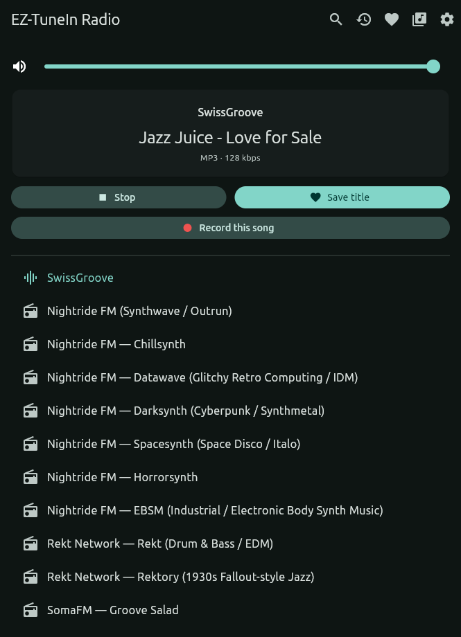
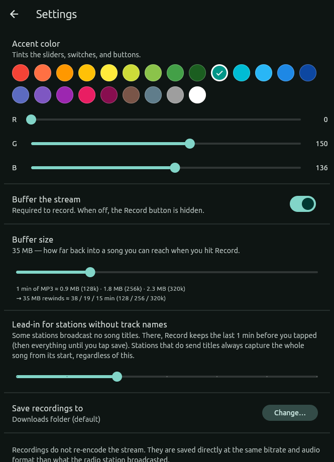
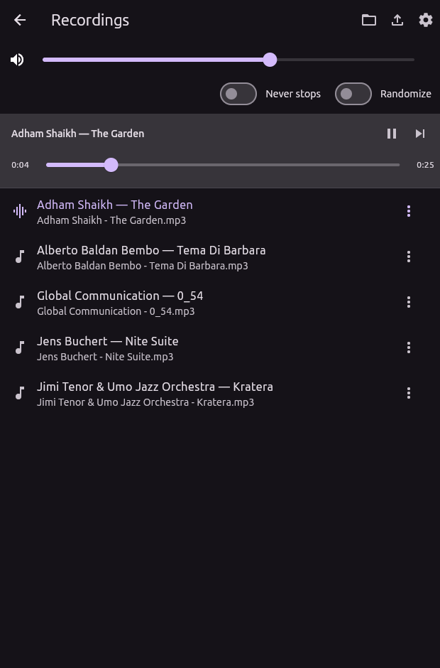

# EZ-TuneIn Radio

**Hear a song you love on the radio — and actually keep it.**

EZ-TuneIn is a minimalist internet-radio player that does what most players
don't: it **records the whole song to your device** — and it works even if you
hit **Record** *after* the song already started, because it quietly buffers the
stream as you listen, so you never miss the intro. Recordings are **lossless and
instant**: the station's own audio, saved as-is, with no re-encoding.

It also **logs every track that plays** and lets you **save the ones you like**
with one tap, then **export your list** as a plain CSV to open in a spreadsheet
or take anywhere.

All from one clean, dark interface — light on resources, no account, no ads.

Runs on **Windows**, **macOS**, **Linux**, and **Android**.

## Screenshots

<p align="center">
  
  
  
</p>
<p align="center">
  <em>Now playing&nbsp;&nbsp;·&nbsp;&nbsp;Recording settings (buffer-size guide)&nbsp;&nbsp;·&nbsp;&nbsp;Recordings library</em>
</p>

## Features

- **Play internet radio** — stream Icecast/Shoutcast stations such as SomaFM's
  Groove Salad, Drone Zone, or SwissGroove. On Android it keeps playing (and
  recording) with the screen off — a notification shows what's on with a **Stop**
  button, so you can pocket the phone and let the music run.
- **Live "now playing"** — see the current artist and track update as the music
  changes. If a station doesn't broadcast track info, the app says so plainly
  instead of leaving you guessing, and it quietly reconnects if the metadata feed
  drops.
- **Save the songs you like** — one click logs the current track.
- **Record a whole song** — hit **Record** and EZ-TuneIn saves the song to a file
  (mp3), *including the part that already played* before you pressed the button (it
  quietly buffers the stream as you listen). Recording finishes on its own when the
  track changes. Lossless and instant — the station's audio is saved as-is, no
  re-encoding. Tune the buffer size and save location in **Recording settings**.
  For stations that don't broadcast track names, **Record** still works — it just
  records until you tap again to save (named after the station and time).
- **Recordings library** — the **library** icon opens a list of your recorded songs;
  tap one to play it (with a seek bar to scrub). Flip **Never stops** to roll into
  the next song automatically, **Randomize** to shuffle, use **skip** to jump ahead,
  and **export** the list as a simple `artist,title` CSV. Each song's **⋮** menu lets
  you **delete** it (to free space) or **share/move** it off the device; on desktop a
  **folder** button opens the recordings folder. On Android it keeps playing with the
  screen off, with **Pause/Play**, **Skip**, and **Stop** on the lock-screen
  notification.
- **Saved tracks view** — browse everything you've saved in a sortable table of
  **date · radio station · artist · title**. Click a column header to sort by it,
  click a row to copy `Artist - Title` to your clipboard, or wipe the list with
  **Clear all**.
- **Play history** — every song that plays is logged automatically (the **clock**
  icon opens it). Same sortable view as saved tracks, plus a live **entry count**
  and a **logging on/off** switch so you can pause recording. Search, export, and
  clear it just like saved tracks.
- **Export your list** — on mobile, **Share** the saved-tracks CSV via the system
  share sheet (email it to yourself, send it to your PC, save to Drive…); on
  desktop the file's already in your Documents folder and the button reveals it.
- **Find stations online** — the **+** button opens a **keyword search** of the
  worldwide [Radio Browser](https://www.radio-browser.info) directory: type a name,
  genre, or city, tick one or several results, and add them all at once (no stream URL
  to hunt down — it fills in the direct link for you). Prefer to type it in yourself?
  The **pencil** in that screen opens the classic name + URL form.
- **Manage your stations** — hover a station to reveal **edit** (rename, change the URL,
  or give it a **colour**) and **delete** icons. Colour a station to tag it by genre or
  flag a favourite — its name and icon show in that colour. Your list is remembered
  between launches.
- **Import / export your stations** — back up or share your station list as a
  simple `name,url` CSV, and import one back in (new stations are merged in;
  duplicates are skipped). Both live at the bottom of the station list.
- **Find a station fast** — just start typing to filter the list by name, or tap
  the **search** icon in the top bar. Press **Esc** (or the **✕**) to clear.
- **Make it yours** — pick an **accent color** in **Settings** (preset swatches
  or exact R/G/B); it re-themes the app instantly.
- **Remembers your setup** — volume, accent color, and (on desktop) the window
  size persist across restarts.

Your saved tracks are written to `radio_saved_tracks.csv` and the play history to
`radio_history.csv` (same columns) — on desktop both live in your **Documents**
folder, so they're easy to open in a spreadsheet (on Android they're app-private
files you browse via the in-app views). **Recorded songs** go to your
**Downloads** folder by default (change it in Recording settings); on Android they
save to the app folder.

## How to install

Grab the latest build from the
[**Releases**](https://github.com/flochrislas/ez-tunein/releases/latest) page — no
toolchain needed. Pick the file for your platform:

### Android

Download `ez-tunein-<version>-android.apk` to your phone and open it. The first
time, you'll need to allow installing from your browser or file manager ("install
unknown apps"). The APK is signed, so later versions install cleanly over it.

### Windows

Download `ez-tunein-<version>-windows-x64.zip`, extract it anywhere, and run
**`ez_tunein.exe`** — nothing else to install. Windows may show a blue
**SmartScreen** warning ("Windows protected your PC") because the app isn't signed
yet; click **More info → Run anyway**.

### macOS

Download `ez-tunein-<version>-macos.dmg`, open it, and drag **EZ-TuneIn** into the
**Applications** folder. The app isn't signed with a paid Apple certificate, so the
first time you launch it macOS says *"EZ-TuneIn cannot be opened because the developer
cannot be verified."* — **right-click (or Control-click) the app → Open**, then confirm
**Open** in the dialog. You only need to do this once. The `.dmg` is universal, so it
runs on both Intel and Apple Silicon Macs.

### Linux

Download `ez-tunein-<version>-linux-x64.tar.gz`, then:

```
sudo apt install -y libmpv-dev mpv      # the audio backend needs libmpv
tar xzf ez-tunein-*-linux-x64.tar.gz
./ez-tunein-linux-x64/ez_tunein
```

Prefer to build it yourself? See **How to build and run** below.

## How to build and run

You'll need the [Flutter SDK](https://docs.flutter.dev/get-started/install). Once
it's installed, from a clone of this repo:

```
flutter pub get
flutter run        # add -d linux or -d windows to target a specific device
```

Platform-specific setup is below.

### Linux

1. **Install Flutter** (if not already). Easiest:
   ```
   sudo snap install flutter --classic
   flutter --version      # first run downloads the Dart SDK
   ```
   (Or follow https://docs.flutter.dev/get-started/install/linux for the tarball method.)

2. **Install libmpv** — the desktop audio backend wraps it:
   ```
   sudo apt install -y libmpv-dev mpv
   ```

3. **Run it:**
   ```
   flutter pub get
   flutter run -d linux
   ```

**Where settings are stored:** your volume, station list, and window size live in:
```
~/.local/share/io.github.flochrislas.eztunein/shared_preferences.json
```
Delete that file (or individual keys like `win_w` / `win_h`) to reset to
defaults — e.g. to get a true "first run" window size again.

### Windows 11

1. **Git for Windows** — https://git-scm.com (Flutter uses it under the hood).
2. **Visual Studio 2022** (Community edition is fine) with the
   **"Desktop development with C++"** workload. This is required to *build*
   Windows desktop apps — VS Code alone is not enough.
3. **Flutter SDK** — clone the stable branch (or download the ZIP from
   https://docs.flutter.dev/get-started/install/windows):
   ```powershell
   git clone --depth 1 -b stable https://github.com/flutter/flutter.git C:\src\flutter
   ```
4. **Add to PATH:** add `C:\src\flutter\bin` via *Settings → Edit environment
   variables for your account → Path → New*, then open a fresh terminal.
5. **Enable Developer Mode** — Flutter needs symlink support to build with
   plugins. Open *Settings → System → For developers* and turn on **Developer
   Mode** (or run `start ms-settings:developers`). Without it the build fails
   with *"Building with plugins requires symlink support. Please enable
   Developer Mode..."*. From an **admin** PowerShell you can also enable it with:
   ```powershell
   reg add "HKLM\SOFTWARE\Microsoft\Windows\CurrentVersion\AppModelUnlock" /t REG_DWORD /f /v AllowDevelopmentWithoutDevLicense /d 1
   ```
6. **Run it** (`media_kit` bundles its own libs on Windows — no libmpv needed):
   ```powershell
   flutter pub get
   flutter run -d windows         # or: flutter build windows
   ```

### Android

Building for Android needs the Android SDK and a **JDK 17+** (not the SDK's GUI
IDE). On Linux, two helper scripts automate the one-time setup:

```bash
bash script/android-sdk-install.sh      # installs the SDK + points Flutter at it
sudo bash script/android-udev-fix.sh    # USB device permissions (phone plugged in)
```

Then enable **USB debugging** on the phone, plug it in, and:

```bash
flutter devices                          # confirm the phone is listed
flutter run                              # build, install, launch
flutter build apk --release              # or produce a release .apk
```

Full walkthrough, gotchas, and release-signing notes:
[`doc/android-build.md`](doc/android-build.md).

## Adding / changing stations

Use the **+** button in the app to add a station. It opens an **online search** of
the [Radio Browser](https://www.radio-browser.info) directory — type a keyword, tick
the results you want, and add them (their direct stream URLs are filled in for you).
The **pencil** icon on that screen switches to the manual name + URL form. Hover a
station in the list to reveal **edit** and **delete** buttons. Your list is saved
between launches.
The defaults in `_defaultStations` (top of `lib/main.dart`) only seed the very
first launch.

> Stream URLs must be **direct** — not `.pls`/`.m3u` playlist links. (Online search
> uses Radio Browser's already-resolved direct URLs, so it handles this for you.)

The first launch seeds a sizeable curated set (see `radios-selection.csv`); to
find one quickly, just **start typing** to filter by name (or tap the search icon
in the top bar). **Esc** clears the filter.

To move your stations between machines, use **Import / Export stations from CSV…**
at the bottom of the list. The file is a plain `name,url` CSV (with a header row)
you can also edit by hand. Import is **non-destructive** — it adds stations whose
URL isn't already in your list and skips the rest. On Linux the file picker needs
`zenity` (or `kdialog`) installed, which most desktops already have.

## Documentation

- [`doc/implementation-notes.md`](doc/implementation-notes.md) — how it's built.
- [`doc/tech-stack.md`](doc/tech-stack.md) — why this stack was chosen.
- [`doc/android-build.md`](doc/android-build.md) — Android SDK setup, device
  setup, and Android-specific gotchas.
- [`doc/windows-signing.md`](doc/windows-signing.md) — notes on signing the
  Windows build and the SmartScreen warning.
- [`doc/releasing.md`](doc/releasing.md) — how to cut a release (version bump,
  tag, the GitHub Actions build, publish).

## License

Released under the **GNU General Public License v3.0**. See [`LICENSE`](LICENSE).
